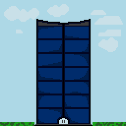
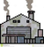
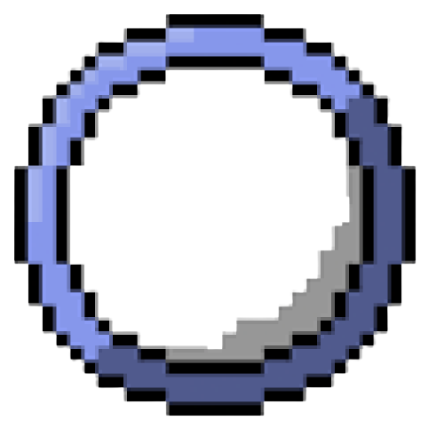

# BoD2

> Earn coins by clicking in the screen

> Switch to others screens by clicking in this icon:

> Go to the store by clicking in this icon at the city:

> The watch shows the time(Each day have 24 seconds)

> At the end of each day, you have to pay the salary of your employees. (The game does not yet have a system for hiring more employees).
